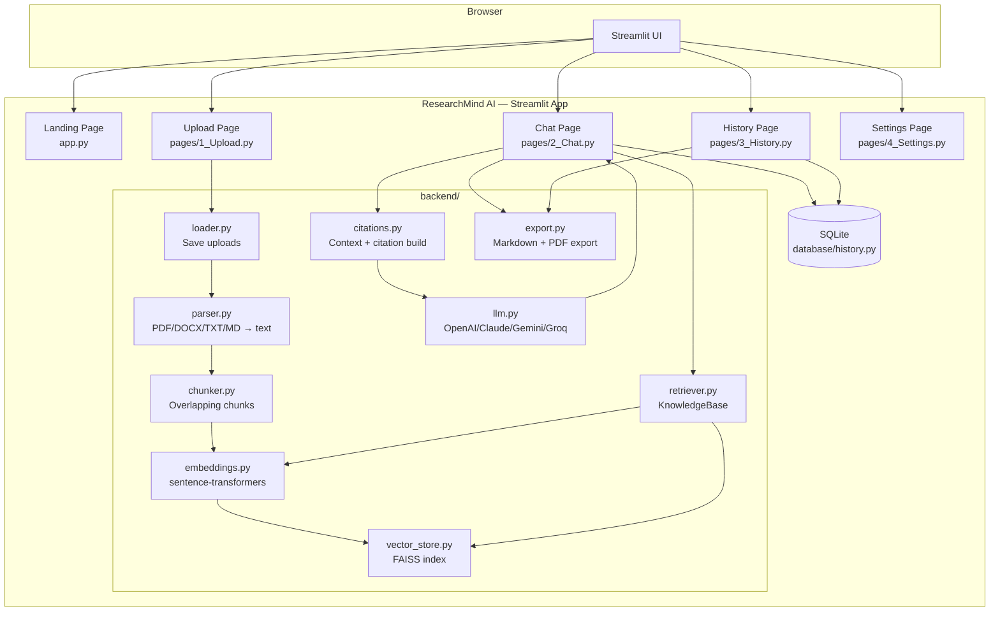
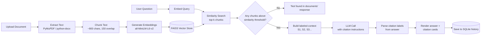
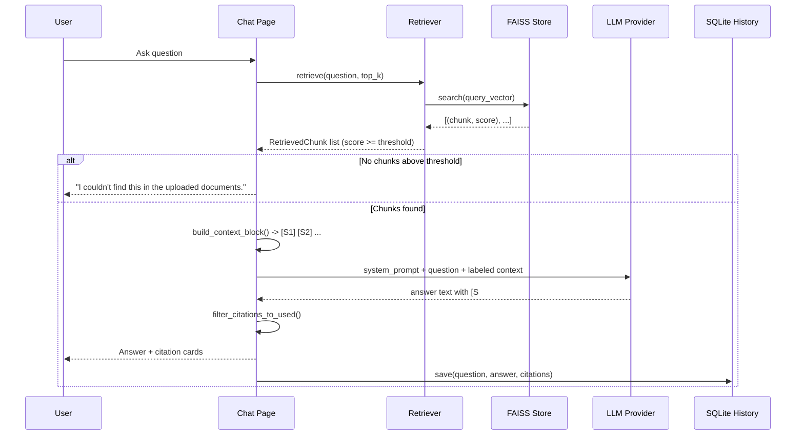

# ResearchMind AI — Architecture

## 1. System Architecture

## 2. Retrieval-Augmented Generation Workflow

## 3. Data Flow: Citation Grounding

## Component Responsibilities

| Layer | Module(s) | Responsibility |
|---|---|---|
| Ingestion | `loader.py`, `parser.py` | Save uploads, extract text + page numbers |
| Processing | `chunker.py` | Split text into overlapping, retrievable chunks |
| Indexing | `embeddings.py`, `vector_store.py` | Vectorize chunks, store/search in FAISS |
| Retrieval | `retriever.py` | Orchestrate ingest + retrieve, own persistence |
| Grounding | `citations.py` | Build labeled prompt context, parse/verify citations |
| Reasoning | `llm.py` | Provider-agnostic LLM call (OpenAI/Claude/Gemini/Groq) |
| Persistence | `database/history.py` | SQLite conversation history |
| Export | `export.py` | Markdown / PDF export of any answer |
| Presentation | `app.py`, `pages/*.py`, `frontend/*` | Streamlit UI, components, theming |

## Why these design choices

- **FAISS `IndexFlatIP` over HNSW/IVF**: exact search is fast enough at hackathon scale
  (hundreds to low thousands of chunks) and avoids tuning approximate-search parameters
  under time pressure. Documented as a scaling tradeoff in the README.
- **Page-level provenance carried from parser → chunk → citation**: this is what makes
  citations trustworthy ("Document X, Page Y") instead of just naming the file.
- **Similarity threshold + explicit "not found" instruction** (belt-and-suspenders):
  chunks below the threshold are dropped before they ever reach the prompt, *and* the
  system prompt instructs the model to say so explicitly — reducing hallucination risk
  from two independent angles.
- **Provider-agnostic LLM layer**: judges/reviewers can run the project with whichever
  of OpenAI, Anthropic, Gemini, or Groq they already have a key for, with zero code changes.
